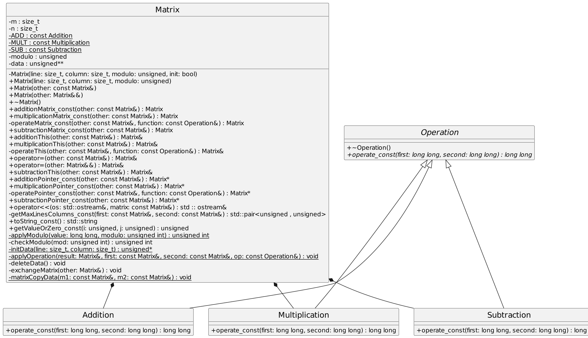

# Rapport laboratoire 1 - POA
Réalisé par Arthur Junod, Samuel Roland et Edwin Häffner

## Compilation

Informations sur le compilateur et CMake

```
$ g++ --version
g++ (GCC) 13.2.1 20231205 (Red Hat 13.2.1-6)

$ cmake --version
cmake version 3.27.7
```

Pour compiler, il suffit de lancer la commande suivante dans le même dossier que le `CMakeLists.txt`.

```
cmake . -Bbuild && cmake --build build/
```

Pour lancer le programme, il suffit ensuite de lancer
```
./build/matrix 2 4 3 4 6
```

**Exemples d'exécution**
```
$  ./build/matrix 2 4 3 4 6
The modulus is 6

one
2 4 4 2
1 5 4 1

two
1 2 2 4
0 5 3 3
5 0 5 2

one + two
3 0 0 0
1 4 1 4
5 0 5 2

one - two
1 2 2 4
1 0 1 4
1 0 1 4

one x two
2 2 2 2
0 1 0 3
0 0 0 0

$ ./build/matrix 1 4 2 3 10
The modulus is 10

one
5 7 9 3

two
2 2 1
6 5 2

one + two
7 9 0 3
6 5 2 0

one - two
3 5 8 3
4 5 8 0

one x two
0 4 9 0
0 0 0 0
```

**Gestion des erreurs des arguments**
```
$ ./build/matrix 
Expected 6 positive integer args!

$ ./build/matrix 3
Expected 6 positive integer args!

$ ./build/matrix 3 2 3 -2 6
Error: Argument -2 should be >= 1

$ ./build/matrix 3 2 3 2 blabla
Error parsing blabla as integer 
```

<div style="page-break-after: always;"></div>

## Conception


### Choix de l'implémentation

#### Représentation des données

Il a été choisi de représenter la matrice comme un tableau C 2D de type `unsigned int`.
Vu qu'on ne devait pas pouvoir stocker de valeurs négatives, ce type nous semblait le plus approprié.

#### Séparation des opérations

Chaque opération a été implémentée dans une classe séparée qui effectue simplement l'opération demandée. Par exemple `Addition` effectue l'addition entre deux opérandes.
Cette approche a été choisie pour pouvoir facilement ajouter de nouvelles opérations ou bien modifier les opérations existantes facilement.

#### Génération aléatoire

Nous avons utilisé la méthode donnée dans l'énoncé pour générer des valeurs aléatoires.

#### Opérations attribut

Toutes les opérations utilisées dans les matrices sont gardées en attributs `private static const`, car, pour notre implémentation, nous n'avons
pas besoin d'une opération par objet `Matrix`.

#### Fonction opérations sur les matrices

Chaque type d'opérations dispose de 3 méthodes différentes que nous pouvons appeler sur une matrice en passant une deuxième par
paramètre. Chaque méthode permet d'éffectuer, comme demandé dans la consigne, les opérations avec 3 type de retour du résultat différent (une qui retourne une nouvelle matrice
allouée statiquement par valeur qui est la matrice résultante de l'opération, une qui retourne un pointeur sur une matrice allouée dynamiquement qui est la matrice résultante de l'opération
et finalement une qui modifie la matrice sur laquelle on appelle la fonction pour qu'elle prenne les valeurs de la matrice résultante de l'opération).

#### Modulo

Nous nous sommes rendus compte que l'opérateur modulo du C++ `%` ne se comporte pas comme l'on veut. Cet opérateur
peut retourner des valeurs négatives, ex : `-8 % 5 = -3`. Pour ce labo, nous voulons des résultats exclusivement
positifs, ce modulo ne peut donc pas convenir pour notre implémentation.
Pour régler ce problème, nous utilisons cette formule : `(x + moduloMatrice % moduloMatrice) % moduloMatrice`.

#### Types des données dans les opérations

C'est en réglant le problème du modulo que nous nous sommes rendus compte que le type `unsigned long` que nous avions choisi
au départ pour le type de retour de nos opérations (Addition, Subtraction et Multiplication) nous posait un problème.
En effet, pour appliquer la formule présentée dans la partie Modulo, il faut que nous utilisons un type signé dans le retour de ces
opérations, car c'est cette formule qui transforme les valeurs négatives du modulo en valeurs positives. C'est pourquoi 
nous utilisons finalement `long long` afin d'être signé et de pouvoir représenter toutes les valeurs du type `unsigned int` (même extrêmes).

#### Constructeur privé

Nous avons un constructeur privé qui nous permet d'initialiser des matrices avec ou sans valeurs. Ce constructeur reste privé, car il est
uniquement utilisé dans le code de certaines fonctions pour lesquelles nous pouvons utiliser des matrices sans aucune valeurs (ex : `operateMatrix()`).
Manipuler ces matrices sans les initialiser nous permet d'éviter de faire des opérations inutiles (allocation, parcours de matrices, etc.).
Le fait d'initialiser des matrices sans valeurs ne doit pas être accessible depuis l'extérieur de la classe, il reste donc privé.

#### Interface `Operation`

Cette interface contient une fonction abstraite pure qui sera implémentée par les classes enfants et également un destructeur marqué comme
abstrait. Celui-ci permet d'éviter de masquer les destructeurs des classes enfants si on essaie de supprimer une instance d'une classe enfant à travers un pointeur de l'interface
et de créer donc un comportement indéfini où l'appel au destructeur serait ambigu entre celui de l'interface et de la classe enfant.

## Avantages et désavantages des différentes méthodes d'opérations

### Modification de la matrice sur laquelle est invoquée la méthode

#### Avantages

- Pas besoin d'allouer de la mémoire pour une nouvelle matrice si jamais la seconde matrice est
de taille inférieure à la première, ce qui nous évite de réallouer de la mémoire.
- Il est pratique de pouvoir modifier directement la matrice sur laquelle on appelle la méthode.

#### Désavantages

- Il faut redimensionner la matrice si jamais la seconde matrice est de taille supérieure à la première.
Ce qui entraine une allocation de mémoire et une copie des valeurs de la matrice originale dans la nouvelle matrice.
- On perd les valeurs de la matrice sur laquelle on appelle la fonction.

### Retourner par valeur une nouvelle matrice résultat allouée statiquement

#### Avantages

- Évite les fuites de mémoire, car la matrice est automatiquement détruite lorsqu'elle sort 
de son "scope".

#### Désavantages

- Très inefficace si la matrice résultante est grande vu qu'on doit la passer par copie.

### Retourner un pointeur sur une nouvelle matrice résultat allouée dynamiquement

#### Avantages

- Permet de retourner la matrice résultante sans devoir la copier.

#### Désavantages

- Nécessite une géstion manuelle de la mémoire donc fuite de mémoire possible. Il faut toujours penser à delete la matrice 
retournée une fois que l'on a fini de l'utiliser.

### Conclusion

La méthode que l'on utilise dépend de ce que l'on veut faire. Si on veut modifier une matrice directement,
la première méthode est la plus appropriée. Si on veut opérer sur des matrices de petites tailles sans devoir se soucier 
de la mémoire, la deuxième méthode est passable meme si en général, on préfère éviter de passer des objets par copie...
Finalement, la troisième méthode est plus compliquée à utiliser, mais elle est plus éfficace. On aurait pu aussi utiliser des `std::unique_ptr`
pour éviter de trop s'embêter avec les delete mais nous avons choisi de ne pas utiliser la STL pour ces opérations.

## Tests
| Nom test                                   | Description                                                                                                           | État   |
|--------------------------------------------|-----------------------------------------------------------------------------------------------------------------------|--------|
| `CanCreateRandomMatrix`                    | Vérifie visuellement que nous pouvons bien créer une matrice en utilisant le constructeur aléatoire                   | PASSED |
| `CanCreateRandomMatrix1x1`                 | Vérifie visuellement que nous pouvons créer une matrice 1x1 en utilisant le constructeur aléatoire                    | PASSED |
| `CanCreateEmptyMatrix`                     | Vérifie que l'on peut créer une matrice 0x0                                                                           | PASSED |
| `CanCreateRandomMatrixWithModulo1`         | Vérifie que l'on peut créer une matrice avec un modulo égal à 1                                                       | PASSED |
| `CanCreateRandomMatrixWithNullModuloFails` | Vérifie que l'on lève bien une exception si l'on essaye de créer une matrice avec un modulo égal à 0                  | PASSED |
| `MatrixStreamOperatorWorks`                | Vérifie que l'opérateur `<<` fonctionne                                                                               | PASSED |
| `CanCopyMatrixViaConstructor`              | Vérifie que le constructeur par copie fonctionne                                                                      | PASSED |
| `CanMoveMatrixAtConstructionOrAffectation` | Vérifie que le constructeur ou l'affectation par déplacement fonctionne                                               | PASSED |
| `CanAddition2Matrix`                       | Vérifie que l'addition fonctionne                                                                                     | PASSED |
| `CanSubtract2Matrix`                       | Vérifie que la soustraction fonctionne                                                                                | PASSED |
| `CanMultiply2Matrix`                       | Vérifie que la multiplication fonctionne                                                                              | PASSED |
| `MatrixCanBeCalculatedWithThemselves`      | Vérifie que l'on puisse calculer des matrices avec elles-mêmes                                                        | PASSED |
| `MatrixSubtractedWithItselfIsFullOfZero`   | Vérifie que la matrice résultante d'une soustraction d'un matrice avec elle-même donne une matrice remplie de 0       | PASSED |
| `OperationsWithNonEqualModulosFail`        | Vérifie que l'on lève bien une exception quand nous essayons de calculer 2 matrices avec un modulo différent ensemble | PASSED |

Pour lancer les tests dans le terminal, il suffit de lancer
```
./build/tests
```
