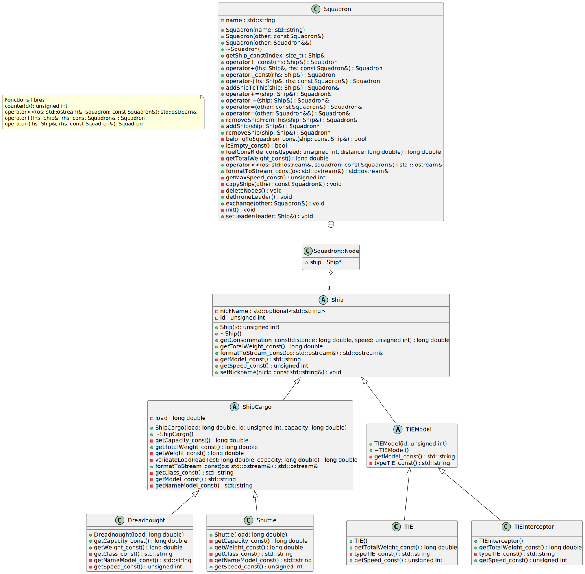

# Lab02 Squadron
Auteurs: Edwin Haeffner, Arthur Junod, Samuel Roland

## Conception
**Diagrammes de classes**



## Choix d'implémentation
### Id des ships
L'id des ships est créé à partir d'un compteur qui est dans une fonction avec template :

````cpp
template <typename T>
unsigned int counterId() {
    static int countId = 1;
    return countId++;
}
````
Cela permet de facilement créer un compteur statique pour les ids spécifiques à chaque ship en appelant la fonction tout en passant en template la classe du ship pour lequel on crée un id.

L'utilisation d'une template copie le code de la fonction pour chaque spécialisation, ce qui permet au compteur d'être dupliqué pour chaque classe.

### Liste dans squadron
Nous avons décidé de mettre les "nodes" de notre liste de vaisseaux dans la classe `Squadron` et de ne pas créer une classe liste externe. Cela permet d'éviter de complexifier le code et de devoir implémenter la règle des 5 dans celle-ci.

Chaque node est donc simplement représentée par une structure interne dans squadron qui contient un pointeur sur un ship et un pointeur sur le prochain node.

On a aussi un pointeur vers la fin de cette liste simplement chainée pour pouvoir facilement rajouter un vaisseau en fin de liste.

### TIEModel
TIModel n'est principalement utile que pour rajouter la partie commune à tous les TIE dans leur nom de modèle ("TIE/").

### ShipCargo
Dans cette classe, nous utilisons une méthode afin de valider que la charge donnée au `ShipCargo` ne dépasse pas sa capacité maximale. Cette fonction, appelée dans le constructeur, prend le paramètre `capacity` qui sera donné dans les classes enfant en passant par la fonction virtuelle pure de `ShipCargo::getCapacity()`.

C'est ici aussi qu'on a redéfini la fonction `formatToStream`, pour pouvoir indiquer le poids total ainsi que le cargo de notre vaisseau.

### Squadron

**Opérateurs `+` et `-`**

Dans le cas des opérateurs + et -, en plus de les avoir implémentés en tant que fonction membre, nous en avons fait des fonctions amies. On a fait cela pour permettre une utilisation plus naturelle de ces opérateurs avec des 
objets Ship et Squadron, notamment la liberté d'ordre des opérandes.

Prenons l'exemple de l'opérateur +. Supposons que nous voulions écrire une expression comme ceci :

```cpp
Squadron lescouade = xwing + lescouade + fauconmillenium;
```

Si l'opérateur + était seulement implémenté en tant que fonction membre, nous ne pourrions pas avoir xwing comme opérande de gauche, car l'opérateur membre n'est défini que pour les objets Squadron. Ainsi, l'expression ci-dessus ne serait pas valide.


### Choix du type de vitesse
Nous avons décidé de garder la vitesse en `unsigned int`, car après vérification, l'unité utilisée (MGLT) ne dépasse jamais au maximum 200 dans l'univers de Star Wars (où elle est utilisée). Cette vitesse aussi n'est jamais représentée avec des valeurs décimales donc cela n'aurait pas de sens de la représenter avec un type plus long ou flottan.

## Test
Nous avons mis quelques tests dans le `main.cpp` qui peuvent être vérifiés visuellement.

| TEST                                                       | RESULTATS |
|------------------------------------------------------------|-----------|
| Affichage avec un seul vaisseau dans le squadron           | PASSED    |
| Affichage avec seulement un leader dans le squadron        | PASSED    |
| Affichage avec un membre et un leader                      | PASSED    |
| Enlever le leader et afficher le squadron avec 3 membres   | PASSED    |
| Test du move constructeur                                  | PASSED    |
| Test de l'opérateur d'assignment                           | PASSED    |
| Test des opérateurs                                        | PASSED    |
| Test de la fonction de calcul de consommation du carburant | PASSED    |


