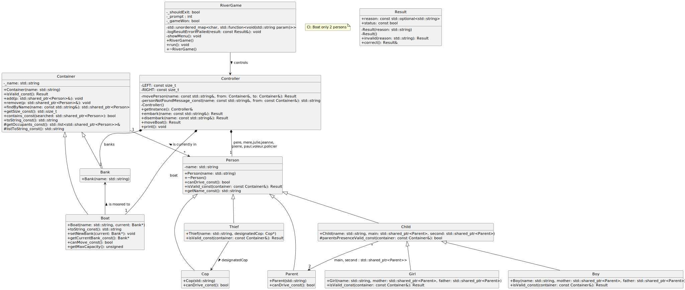

# Rapport Lab03_Rivière
> Auteurs: Junod Arthur, Roland Samuel, Häffner Edwin
## Aperçu Général

Le labo Rivière est une application console développée en C++ qui simule un jeu de logique où les joueurs doivent déplacer des personnages d'une rive à l'autre tout en respectant certaines règles. Le jeu est contrôlé par des commandes entrées par l'utilisateur.

Le but du jeu est d'amener tous les personnages d'une rive à l'autre en respectant les règles données dans l'énoncé.

## Structure du projet

- Classes principales:
    
    - `Person`: Représente un personnage du jeu.
    - `Container`: Représente les endroits où l'on peut placer les personnages. (`Boat` représentant le bateau qui transporte les personnages et `Bank` représentant les rives).
    - `Controller`: Représente le contrôleur du jeu. Il a les différents `Container` et permet aux personnages de passer d'un `Container` à un autre.
    - `RiverGame`: Gère les entrées utilisateurs ainsi que la boucle de jeu.
    - `Result`: Classe permettant de retourner le résultat d'une action (réussite ou non) ainsi que la raison de l'échec.

## Choix d'implémentations
### Classe `Result`
Nous avons décidé de créer une classe `Result` qui nous permet de retourner la réussite ou non des actions que l'utilisateur essaie de faire. L'avantage de cette classe est qu'elle nous permet également de récupérer la raison pour la laquelle l'action n'a pas réussi.

Nous écrivons "en dur" la raison pour laquelle l'action ne peut pas aboutir afin de représenter les erreurs.

Nous l'avons implémentée en utilisant des fonctions statiques qui nous permettent de facilement créer un objet `Result` qui est soit `correct()`, soit `invalid()`.

### Classe `Child` et ses dérivées
Notre hiérarchie étant une hiérarchie de règles et de personnes, nous avons utilisé une classe `Child` abstraite qui prend un `Parent` principal et un secondaire. Cela permet de faire appel à ce constructeur dans celui des classes dérivées `Boy` et `Girl` qui eux prendront deux objets `Parent` considérés comme un *père* et une *mère* en attributs et de les donner en paramètres *main* ou *second* respectivement à leurs règles.

### Les autres classes dérivées de `Person`

Nous avons choisi de créer une classe par type de Personne pour pouvoir facilement mettre en place des règles par type. Par exemple, le voleur doit faire attention s'il est tout seul ou bien accompagné de son policier assigné. De cette façon, chaque personne, selon sa classe, va devoir faire sa propre vérification lors de déplacement. Si nous devons rajouter des règles, il est plus simple de directement les implémenter dans la classe de la personne concernée et non plus haut.

### Classe `Controller` et `Container`

Dans les déplacements (embark et disembark), on fait des copies de `Container` pour pouvoir simuler ces déplacements sans modifier le `Container` originel. Cette copie est très légère, car `Container` ne contient que des pointeurs sur les Personnes et un nom. Nous copions le `Container` entier, car dans cet objet, nous avons une fonction `bool contains(std::shared_ptr<Person> searched)` qui nous indique si le `Container` contient la personne donnée. Ce qui est ensuite utilisé dans le Controller pour vérifier si la personne indiquée par l'utilisateur est bien présente dans le `Container`.

### Classe `RiverGame`

Afin de se rapprocher de la structure que nous avions vu pendant le laboratoire "calculatrice" en POO le semestre passé, nous avons décidé de créer cette classe qui contient donc toute la logique du jeu et également la *unordered_map* qui fait le lien entre les représentations en *string* des actions (ce que le client manipule) et l'appel aux fonctions qui exécute ces actions.

Au final, nous appelons la fonction `run()` dans le `main()` qui va boucler tant que l'utilisateur ne demande pas à terminer le jeu ou jusqu'à ce qu'il finisse le jeu.

### Utilisation des pointeurs intelligents

Nous avons utilisé des pointeurs intelligents pour gérer la mémoire de manière plus sûre. Cela nous évite d'avoir à nous occuper de libérer manuellement la mémoire et nous permet également de ne plus avoir besoin d'implémenter la règle des 5 pour la classe `Container`. Bien qu'il y ait un léger surcoût (overhead) lors de l'utilisation de ces pointeurs, en particulier les `shared_ptr`, cela ne devrait pas poser de problème pour notre application étant donné que le nombre de personnages est très limité... Augmenter de façon significative ce nombre n'aurait pas non plus de sens, car cette application reste un jeu de logique qui se doit de rester simple. Ainsi, l'utilisation de ces pointeurs intelligents est pertinente dans ce contexte.

### Singleton `Controller`

Nous avons décidé de mettre en place le modèle de conception **Singleton** pour le `Controller`, car il ne doit exister qu'une instance de `Controller` en même temps pour ce labo. Avoir plusieurs `Controller` ne ferait aucun sens.

## Test 

Nous avons testé notre programme visuellement en jouant au jeu et en vérifiant que les règles étaient bien respectées. 

| TEST                                                                                | RESULTATS |
|-------------------------------------------------------------------------------------|-----------|
| Affichage si une commande est erronée ou non                                        | PASSED    |
| Un garçon ne peut pas être seul avec sa mère sans son père                          | PASSED    |
| Une fille ne peut pas être seule avec son père sans sa mère                         | PASSED    |
| On peut avoir au maximum 2 personnes sur un bateau                                  | PASSED    |
| Le voleur doit être soit tout seul, soit avec le policier sur chaque container      | PASSED    |
| Le bateau ne peux pas être bougé s'il n'y a pas au moins un conducteur sur celui-ci | PASSED    |
| Les commandes d'embarquement et de débarquement font la vérification des règles     | PASSED    |
| Le reset du `Controller` se fait correctement                                       | PASSED    |
